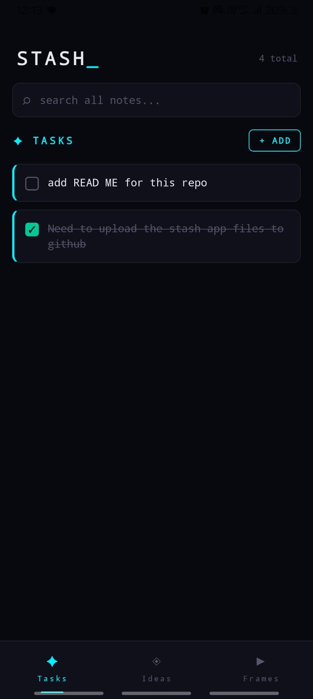
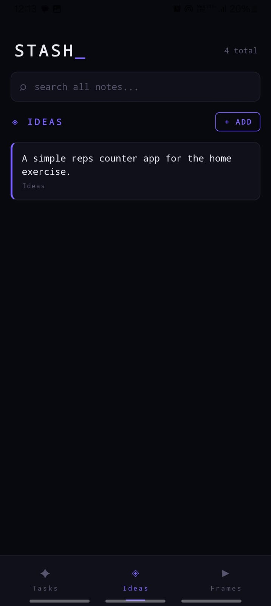
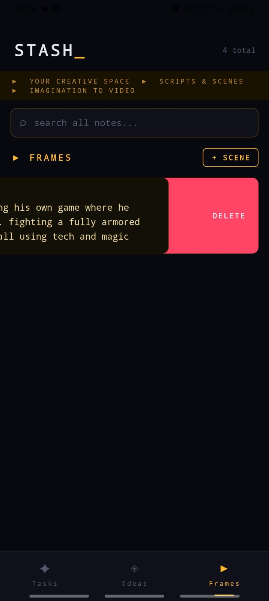

# STASH_

> A fast, dark, personal note-taking app for capturing tasks, ideas, and creative scripts on the go.

Built with React Native + Expo. Designed for people who think faster than they can write.

---

## Screenshots





---

## Features

- **Tasks** — capture things you need to do, check them off when done
- **Ideas** — dump your random thoughts, IT concepts, data science ideas
- **Frames** — write scripts, scenes, and stories for your animated video projects
- **Global Search** — search across all three sections at once
- **Swipe to Delete** — swipe any card left to remove it
- **Offline First** — everything stored locally on your device, no internet needed
- **Dark Futuristic UI** — techy monospace aesthetic with cyan, violet, and amber accents

---

## Tech Stack

- [React Native](https://reactnative.dev/)
- [Expo](https://expo.dev/)
- [AsyncStorage](https://react-native-async-storage.github.io/async-storage/) — local data storage
- [EAS Build](https://docs.expo.dev/build/introduction/) — APK build system

---

## Getting Started

### Prerequisites
- Node.js v18+
- Expo Go app on your Android device

### Installation

```bash
# Clone the repo
git clone https://github.com/Mohith-151/Stash.git

# Navigate into the project
cd Stash

# Install dependencies
npm install
npm install @react-native-async-storage/async-storage

# Start the development server
npx expo start
```

Scan the QR code with Expo Go on your Android device.

---

## Building the APK

```bash
# Install EAS CLI
npm install -g eas-cli

# Login to your Expo account
eas login

# Build the APK
eas build -p android --profile preview
```

Download the APK from the Expo dashboard and install it directly on your device.

---

## Project Structure

```
Stash/
├── app/
│   └── (tabs)/
│       ├── index.tsx       # Main app — all three sections
│       └── _layout.tsx     # Tab layout config
├── assets/                 # Icons and images
├── app.json                # Expo config
└── package.json
```

---

## Roadmap

- [ ] Edit notes by tapping
- [ ] Floating quick-add button
- [ ] Home screen widget for Tasks
- [ ] Cloud backup (Firebase)
- [ ] Custom themes

---

## License

MIT License — feel free to use, modify, and build on this.

---

*Built by [Mohith](https://github.com/Mohith-151) — from a simple idea on a morning walk to a real app on my phone, in one day.*
